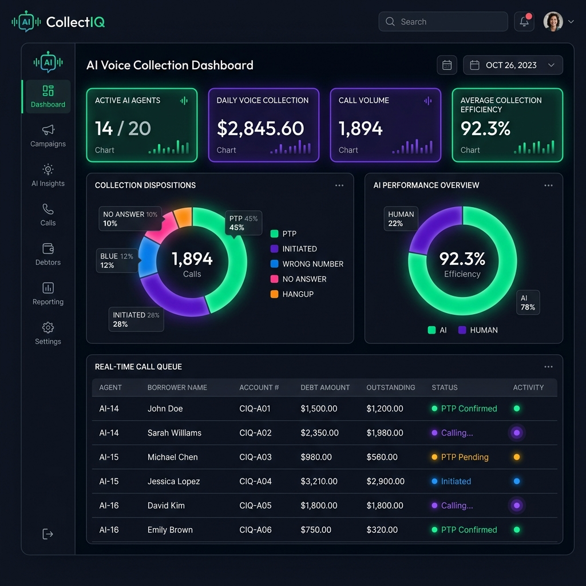
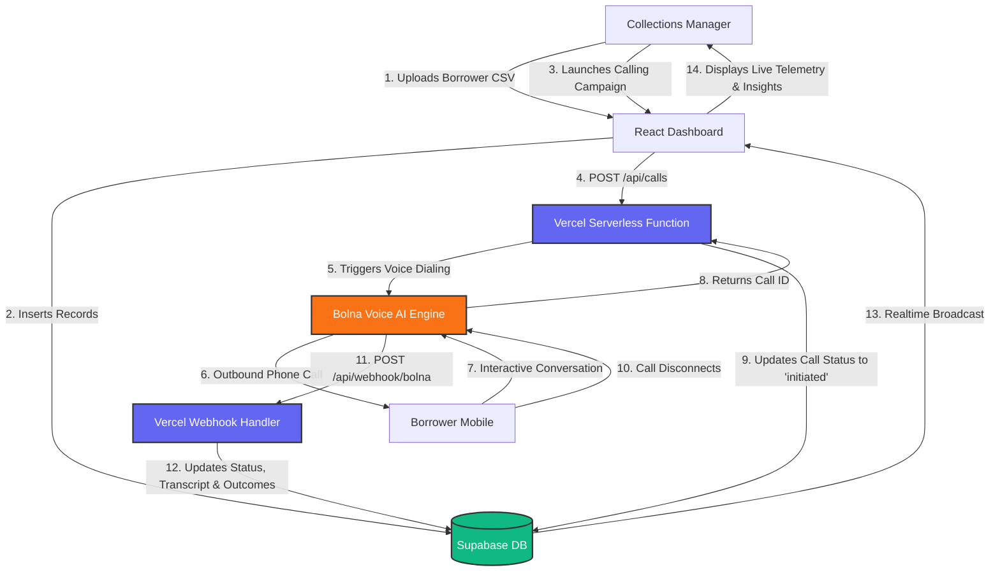
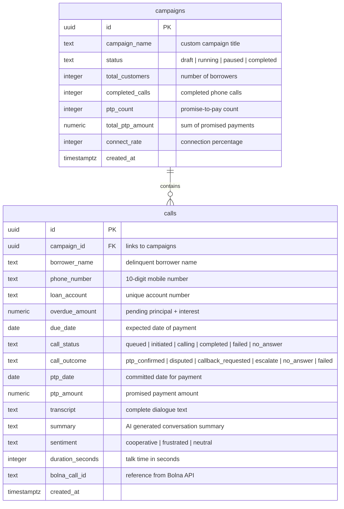

# 🚀 CollectIQ — AI-Powered Voice Collections Dashboard

[](https://react.dev)
[](https://www.typescriptlang.org/)
[](https://vite.dev)
[](https://tailwindcss.com/)
[](https://supabase.com/)
[](https://vercel.com/)
[](https://bolna.ai/)

**CollectIQ** is an enterprise-grade operational control center and analytics dashboard designed specifically for Non-Banking Financial Companies (NBFCs), fintechs, and digital lenders. It bridges the gap between collections management and state-of-the-art conversational voice AI, orchestrating automated outbound calling campaigns through **Bolna AI Agents** and providing real-time telemetry, conversational insights, and transaction tracking.

Rather than relying on tedious manual dialers, collections managers can upload overdue borrower lists (CSV), launch targeted automated voice campaigns, monitor progress live, and drill down into AI-transcribed conversations—recovering outstanding dues quickly, transparently, and at scale.

---

## 📺 Live Action Demo



*The executive operational control center showing live dialing metrics, campaigns, hourly call volume breakdown, and real-time outcome streams.*

---

## 📐 System Architecture & Flow

CollectIQ uses a highly responsive, modern, event-driven architecture. Supabase serves as both the relational data storage engine (PostgreSQL) and the messaging pipeline (via PostgreSQL WAL Replication WebSockets) to feed live updates directly to the react-based dashboard without requiring manual polling.



### End-to-End Operational Lifecycle:
1. **List Upload:** The collections manager uploads a `.csv` list of delinquent accounts. CollectIQ parses and auto-aligns column headers, saving the borrower profiles and staging a campaign in a `draft` status.
2. **Campaign Launch:** The manager clicks "Run Campaign," changing the campaign status to `running`. The dashboard invokes the serverless functions to queue calls.
3. **AI Dispatch:** Vercel serverless functions handle rate-limiting and sequentially dispatch call instructions to the Bolna Voice AI Engine with user-specific context (Borrower Name, Due Date, Overdue Amount, Preferred Language).
4. **AI Dialogue:** The Bolna Agent dials the borrower and executes a customized collection script (available in English, Hindi, or Hinglish).
5. **Real-time Webhook & Telemetry:** Upon hang-up, Bolna instantly forwards call statistics, outcomes (PTP confirmed, disputed, callback, etc.), and the complete conversation transcript to the `/api/webhook/bolna` endpoint. 
6. **Supabase Realtime Feed:** The webhook updates the PostgreSQL database. Supabase immediately broadcasts the transaction delta over WebSockets, allowing the React UI to animate telemetry metrics, tables, and progress charts in real time.

---

## 🗄️ Database Architecture (PostgreSQL Schema)

The database runs on Supabase (PostgreSQL), utilizing foreign-key relationships, strict check constraints to ensure data sanitization, and database views for fast aggregate query executions.



### schema.sql Breakdown
* **`campaigns`**: Collection run batches. Campaign metrics are dynamically updated as calls execute. Campaign progress moves through an explicit state machine: `draft` ➡️ `running` ➡️ `paused` ➡️ `completed`.
* **`calls`**: Unified call and borrower record sheet. Retains customer details alongside call metadata including call duration, outcome categorization, sentiment analysis, PTP (Promise-to-Pay) targets, and complete dialog transcripts.
* **`campaign_metrics` View**: A high-speed SQL view that dynamically aggregates analytics per campaign (calculating connect rates, PTP conversion ratios, average durations, and overall cash collection projections) to deliver sub-millisecond response times for the front-end dashboard KPI cards.

---

## ✨ Features

- **🚀 Live Campaign Control Center:** Launch, pause, and monitor automated outbound voice agent dialers in real time with visual status transitions and instant UI updates.
- **📊 Real-time Operations Dashboard:** Live visual tickers of metrics (PTP Rate, Connection Rate, Total PTP Amount Promised, Call Volume by Hour, and Outcome Breakdown charts) powered by Supabase WebSockets.
- **💬 Conversational Deep-Dives:** Complete speech-to-text transcript reviews for completed calls, highlighting structural markers like Promise-to-Pay (PTP) agreements, disputes, escalations, or request callbacks.
- **📁 Smart CSV Processing & Importer:** Drag-and-drop CSV upload zone with an intelligent fuzzy column-matching engine (e.g., auto-maps `borrower_name` or `mobile` to schema columns) and structural data preview tables prior to ingestion.
- **🎨 Premium Visual Experience:** Tailored dark-mode UI with sleek glassmorphism panels, harmonious emerald-and-violet-accented color palettes, custom chart systems using Recharts, and custom animations.
- **⚙️ Seamless Local Environment Injection:** Embedded server-side loaders that automatically locate and parse environment files to prevent runtime environment variable crashes.

---

## ⚡ Tech Stack

| Layer | Technology | Description |
|-------|------------|-------------|
| **Frontend Framework** | React 19 + TypeScript | High-performance, strictly typed rendering and state architecture. |
| **Asset Builder** | Vite v7 | Ultra-fast next-gen build toolchain and development server. |
| **Styling & CSS** | Tailwind CSS v3 + CSS Variables | Harmonized design system leveraging clean utility classes and dark-theme configurations. |
| **Backend & APIs** | Vercel Serverless Functions | Highly scalable Node.js API handlers for secure API proxying and webhook integrations. |
| **Database** | Supabase (PostgreSQL) | Fully relational PostgreSQL database, real-time replication subscription engine, and robust security policies. |
| **Parser Engine** | PapaParse | High-throughput browser-based client-side CSV parsing. |
| **Telemetry & Visualization** | Recharts | Responsive SVG charts mapping chronological dial volumes and categorical distributions. |
| **Icons & Typography** | Lucide React + Google Fonts | Clean vector iconography matched with *Outfit* (headings) and *Fira Code* (telemetry) fonts. |

---

## 🛠️ Local Installation & Setup

Ensure you have **Node.js 20+** and **npm 10+** installed before proceeding.

### 1. Ingest Repository and Install Dependencies
Clone the repository and install all node packages:
```bash
git clone https://github.com/your-username/collectiq-dashboard.git
cd collectiq-dashboard/app
npm install
```

### 2. Set Up Supabase Database
1. Create a free project at [Supabase](https://supabase.com).
2. Go to the **SQL Editor** in your Supabase Dashboard.
3. Paste the contents of `supabase/schema.sql` into the editor and click **Run**. This initializes tables, views, Row-Level Security (RLS) policies, and enables the real-time WebSocket replication filter.

### 3. Environment Variable Settings
Create a `.env` or `.env.local` file inside the `app/` directory (or the root project directory) and populate it with your credentials:

```env
# Supabase Configuration (Exposed to the browser bundle)
VITE_SUPABASE_URL=https://your-project-id.supabase.co
VITE_SUPABASE_ANON_KEY=eyJhbGciOiJIUzI1NiIsInR5cCI...

# Server-Side Keys (Required for Serverless API Functions, NEVER prefixed with VITE_)
SUPABASE_URL=https://your-project-id.supabase.co
SUPABASE_SERVICE_ROLE_KEY=eyJhbGciOiJIUzI1NiIsInR5cCI...

# Secure Bolna Voice AI Credentials (Kept strictly on Vercel Serverless side for security)
BOLNA_API_KEY=bn-your-bolna-api-key
BOLNA_AGENT_ID=your-voice-agent-uuid
BOLNA_WEBHOOK_SECRET=your-shared-webhook-secret-token
```

> [!WARNING]
> **API Key Protection:** To comply with security best practices, the Bolna API Credentials (`BOLNA_API_KEY` and `BOLNA_AGENT_ID`) are configured **exclusively** on the server side (accessed inside `/api/*` routes) and are never exposed to the React browser client-side bundle.

### 4. Start the Dev Server
Launch Vercel CLI or local Vite runner to start developing:
```bash
# Using Vercel CLI (highly recommended to test API endpoints locally)
vercel dev

# Or start using standard Vite (Vite runs on port 3000 as configured in vite.config.ts)
npm run dev
```

---

## 🔗 Local Webhook Tunneling (Receiving Calls Locally)

To receive real-time webhook callback notifications from the Bolna Voice engine on your local development machine, you must expose your local port via a secure tunnel.

```bash
# 1. Install Ngrok globally
npm install -g ngrok

# 2. Expose your Vercel dev server port (default: 3000)
ngrok http 3000

# 3. Copy the secure HTTPS URL generated by Ngrok
#    Example: https://a1b2-34-56-78.ngrok-free.app

# 4. Configure your Webhook URL on the Bolna Dashboard:
#    https://a1b2-34-56-78.ngrok-free.app/api/webhook/bolna

# 5. Make sure BOLNA_WEBHOOK_SECRET matches in your .env and Bolna dashboard settings
```

---

## 📡 API Reference Manual

CollectIQ exposes serverless backend endpoints designed to secure private keys, dispatch outbound phone calls safely, and handle inbound webhook event triggers.

### 1. Dispatch Campaigns (`POST /api/calls`)
Invoked by the front-end dashboard when a collection manager starts a draft campaign. Retrieves all call queue records associated with the campaign ID and dispatches requests to the Bolna calling APIs.
* **Payload Format:**
  ```json
  {
    "call_id": "461ad3de-f280-4483-9599-8132b1645754"
  }
  ```
* **Success Response (200 OK):**
  ```json
  {
    "success": true,
    "bolna": {
      "call_id": "bolna-call-uuid-12345",
      "status": "queued"
    }
  }
  ```

### 2. Manual Call Trigger (`POST /api/trigger`)
Directly dials a single borrower in real time. Typically used by collection supervisors to execute urgent escalations or verify call validity.
* **Payload Format:**
  ```json
  {
    "call_id": "call-record-uuid",
    "borrower_name": "Rajesh Kumar",
    "phone_number": "9876543210",
    "overdue_amount": 45000,
    "due_date": "2026-11-15",
    "loan_account": "LN2024001",
    "language": "hinglish"
  }
  ```

### 3. Inbound Webhook Callback (`POST /api/webhook/bolna`)
Standardized webhook hook called by the Bolna Engine when a call terminates. Validates the caller using the shared webhook secret, updates database states, records user outcomes, and ingests transcripts.
* **Payload Format:**
  ```json
  {
    "call_id": "bolna-call-uuid-12345",
    "outcome": "ptp_confirmed",
    "transcript": "Agent: Namaste Rajesh ji, aapka ₹45,000 ka loan outstanding hai... Borrower: Haan haan main parso pay kar dunga...",
    "summary": "Borrower promised to pay outstanding ₹45,000 on 2026-05-22.",
    "ptp_amount": 45000,
    "ptp_date": "2026-05-22",
    "duration_seconds": 45
  }
  ```
* **Success Response (200 OK):**
  ```json
  {
    "success": true
  }
  ```

---

## 📈 Outcome Metrics & Standard Categorization

The Bolna Voice AI categorizes conversation results based on user speech-to-text patterns:

| Outcome Code | UI Label | Description | Action Trigger |
|--------------|----------|-------------|----------------|
| `ptp_confirmed` | **PTP Confirmed** | Borrower acknowledges delinquent dues and commits to pay on a specific date. | Updates due projection metrics; queues automated SMS/WhatsApp reminders. |
| `disputed` | **Disputed** | Borrower claims to have already paid, disputes interest calculation, or denies loan. | Flags account as "Disputed" in DB; pauses calling loop; alerts credit compliance. |
| `callback_requested` | **Callback** | Borrower asks to be called at another time (e.g. busy, driving, sleeping). | Reschedules dialer queue to user-preferred window. |
| `escalate` | **Escalated** | Conversation highlights highly emotional speech, complex queries, or refusal to pay. | Transfers customer file to an experienced human collections specialist. |
| `no_answer` | **No Answer** | Phone rings out completely, user busy, or mobile switched off. | Triggers cool-down period before adding to automatic retry queue. |
| `failed` | **Failed** | Technical dialing error, network failure, or empty call state. | Logs error event and cues immediate failover recovery. |

---

## 📋 CSV Upload Standard Formatting Guide

The system features a fuzzy-matching processor that reads standard `.csv` files. You can utilize the template below to format uploads:

```csv
name,phone,loan_account,overdue_amount,due_date,language,bucket
Rajesh Kumar,9876543210,LN2024001,45000,2026-11-15,hindi,31-60
Priya Sharma,9123456789,LN2024002,18500,2026-11-10,english,0-30
Amit Patel,9988776655,LN2024003,125000,2026-10-28,hindi,61-90
Sneha Gupta,9876512345,LN2024004,67000,2026-11-05,english,31-60
```

> [!NOTE]
> Column order does not matter. The fuzzy processor supports common naming conventions:
> * **Name:** `name`, `borrower_name`, `customer_name`, `full_name`
> * **Phone:** `phone`, `phone_number`, `mobile`, `contact`, `mobile_number`
> * **Loan Account:** `loan_account`, `account_no`, `loan_id`, `account_id`
> * **Overdue Amount:** `overdue_amount`, `amount`, `outstanding`, `due_amount`, `pending_amount`
> * **Due Date:** `due_date`, `payment_date`, `date_due`, `expected_date`

---

## 🔮 Next Phase Roadmap

- **🛡️ Immutable Audit Ledger with Cryptographic Hash Chaining:** Implement a compliance audit ledger employing SHA-256 state-chaining to ensure tamper-proof consent logging per NBFC regulatory guidelines, exportable as certified PDFs for seamless RBI audit verification (incorporating 7-year record retention protocols).
- **🔁 Automatic Multi-Dial Retry Engine:** Configurable retry schedules (maximum 3 calls with exponential backoff thresholds) restricting dials to regulatory-compliant hours (e.g., 9:00 AM – 7:00 PM).
- **💬 Auto-Generated WhatsApp Confirmations:** Triggers customized WhatsApp messages containing official payment gateways and receipt confirmations immediately following a successful Promise-to-Pay (PTP) call.

---

## 📄 License

CollectIQ is **Private Proprietary Software**. All rights reserved. Unauthorized copying, distribution, or reproduction of code files is strictly prohibited.
