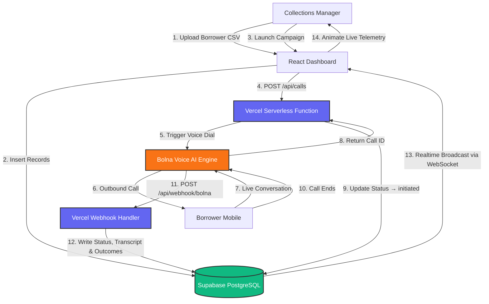
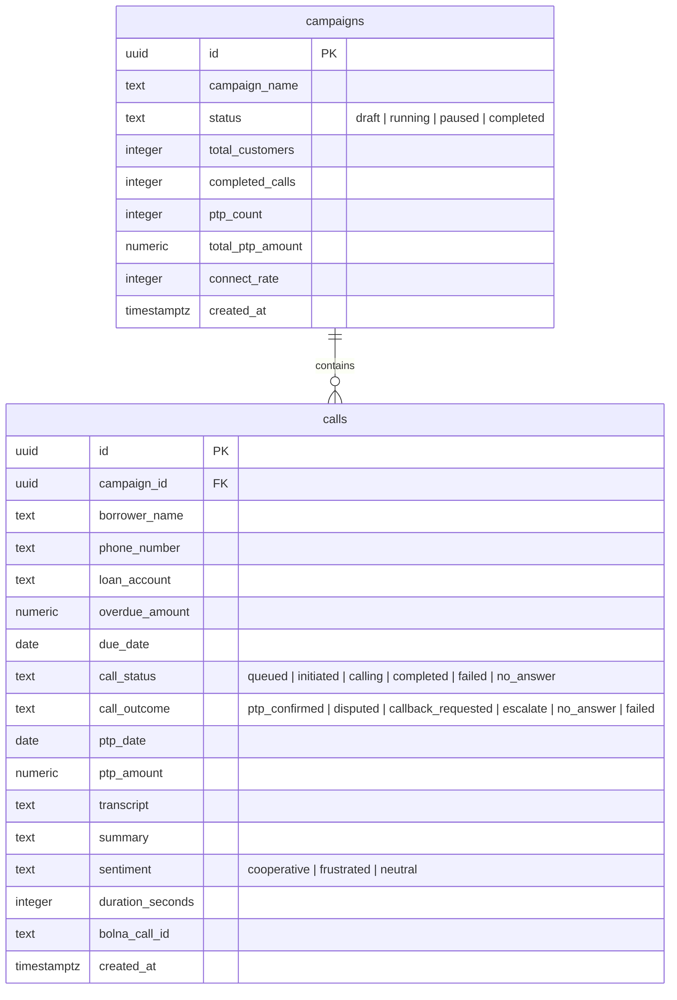

<div align="center">

# 📞 CollectIQ

### AI-Powered Voice Collections Dashboard for Modern Lenders

*Orchestrate automated outbound calling campaigns, monitor live telemetry, and recover outstanding dues — at scale.*

<br/>

[](https://react.dev)
[](https://www.typescriptlang.org/)
[](https://vite.dev)
[](https://tailwindcss.com/)
[](https://supabase.com/)
[](https://vercel.com/)
[](https://bolna.ai/)
[](#license)

<br/>

[Overview](#overview) · [Architecture](#architecture) · [Features](#features) · [Tech Stack](#tech-stack) · [Database Schema](#database-schema) · [API Reference](#api-reference) · [Setup](#setup) · [Roadmap](#roadmap)

<br/>


*Live operations control center — real-time dialing metrics, campaign management, hourly call volume, and outcome streams.*

</div>

---

## Overview

**CollectIQ** is an enterprise-grade collections intelligence platform built for NBFCs, fintechs, and digital lenders. It replaces manual dialer workflows with a fully automated, AI-driven voice calling engine — orchestrated through [Bolna AI](https://bolna.ai/) — and surfaces every metric, transcript, and outcome in a live, event-driven dashboard.

Collections managers upload a borrower CSV, launch a campaign, and watch the system work: AI agents dial borrowers, conduct natural conversations in English, Hindi, or Hinglish, classify outcomes, and stream results back to the dashboard in real time via Supabase WebSockets.

**Core value proposition:**

| Without CollectIQ | With CollectIQ |
|---|---|
| Manual dialer queues, agent fatigue | Fully automated AI voice campaigns |
| Delayed outcome reporting | Sub-second real-time telemetry via WebSockets |
| Inconsistent call scripts | Structured, multilingual AI dialogue |
| Scattered call logs | Unified transcript + sentiment + PTP tracking |
| No audit trail | Immutable outcome records in PostgreSQL |

---

## Architecture

CollectIQ is built on an event-driven, serverless architecture. Supabase acts as both the relational data store (PostgreSQL) and the real-time messaging layer (WAL replication over WebSockets), eliminating polling entirely.



### End-to-End Lifecycle

| Step | Actor | Action |
|------|-------|--------|
| **1. List Upload** | Manager | Uploads `.csv` of delinquent accounts. CollectIQ fuzzy-maps columns and stages a `draft` campaign. |
| **2. Campaign Launch** | Manager | Clicks "Run Campaign." Status transitions to `running`. |
| **3. AI Dispatch** | Serverless | Vercel functions rate-limit and sequentially dispatch call instructions to Bolna with borrower context. |
| **4. AI Dialogue** | Bolna Agent | Dials borrower, executes a multilingual collection script, classifies the outcome. |
| **5. Webhook Ingestion** | Bolna → Vercel | On hang-up, Bolna POSTs call stats, outcome, sentiment, and full transcript to `/api/webhook/bolna`. |
| **6. Realtime Broadcast** | Supabase | PostgreSQL WAL delta is broadcast over WebSocket. React UI updates without a single poll. |

---

## Features

<details>
<summary><strong>🚀 Live Campaign Control Center</strong></summary>

Launch, pause, and monitor automated outbound voice campaigns in real time. Visual status chips reflect the campaign state machine (`draft → running → paused → completed`) with instant UI transitions backed by Supabase Realtime.
</details>

<details>
<summary><strong>📊 Real-Time Operations Dashboard</strong></summary>

Live-ticking KPI cards for PTP Rate, Connection Rate, Total PTP Amount, and Call Volume. Hourly call volume bar charts and outcome distribution pie charts update in real time via WebSocket deltas — no refresh required.
</details>

<details>
<summary><strong>💬 Conversational Deep-Dives</strong></summary>

Full speech-to-text transcript viewer for every completed call. Structural markers highlight PTP agreements, disputes, escalation triggers, and callback requests. AI-generated summaries and sentiment scores (`cooperative / neutral / frustrated`) are surfaced alongside raw dialogue.
</details>

<details>
<summary><strong>📁 Smart CSV Importer</strong></summary>

Drag-and-drop upload zone with a fuzzy column-matching engine. Automatically maps non-standard headers (`mobile`, `contact`, `borrower_name`, etc.) to the canonical schema. Renders a structured preview table before ingestion so managers can validate data before committing.
</details>

<details>
<summary><strong>🌐 Multilingual Voice Scripts</strong></summary>

Bolna AI agents execute collection scripts in **English**, **Hindi**, and **Hinglish** — selectable per borrower row in the CSV. Language context is injected at call dispatch time.
</details>

<details>
<summary><strong>🎨 Premium Dark-Mode UI</strong></summary>

Glassmorphism panels, emerald-and-violet accent palette, custom Recharts visualizations, and smooth CSS animations. Typography uses *Outfit* for headings and *Fira Code* for telemetry numerics.
</details>

---

## Tech Stack

| Layer | Technology | Role |
|-------|-----------|------|
| **UI Framework** | React 19 + TypeScript 5.x | Strictly typed component tree with concurrent rendering |
| **Build Toolchain** | Vite v7 | Sub-second HMR, optimized production bundles |
| **Styling** | Tailwind CSS v3 + CSS Variables | Utility-first dark-theme design system |
| **Serverless Backend** | Vercel Serverless Functions | Secure API proxy, call dispatch, webhook ingestion |
| **Database & Realtime** | Supabase (PostgreSQL + WebSockets) | Relational storage + WAL-based live event streaming |
| **CSV Parsing** | PapaParse | High-throughput client-side CSV processing |
| **Charts** | Recharts | Responsive SVG visualizations for time-series and categorical data |
| **Icons** | Lucide React | Consistent vector iconography |
| **Fonts** | Google Fonts (Outfit + Fira Code) | Typographic hierarchy for UI and telemetry |
| **Voice AI** | Bolna AI | Outbound voice agent orchestration and NLP outcome classification |

---

## Database Schema

Hosted on Supabase PostgreSQL. Uses foreign-key constraints, check constraints for state validation, and a materialized view for sub-millisecond KPI aggregation.



### Schema Notes

- **`campaigns`** — Batch-level collection runs. Metrics (`ptp_count`, `connect_rate`, etc.) are updated incrementally as calls complete.
- **`calls`** — Unified borrower + call record. Stores the full dialogue transcript, AI-generated summary, sentiment classification, and PTP commitment details alongside call metadata.
- **`campaign_metrics` View** — Aggregates per-campaign KPIs (connect rate, PTP conversion ratio, average duration, cash collection projection) for instant dashboard queries without expensive runtime joins.

To initialize the schema, paste `supabase/schema.sql` into the Supabase SQL Editor and run it. This creates all tables, the metrics view, RLS policies, and enables the Realtime replication filter.

---

## API Reference

All endpoints are Vercel Serverless Functions. Server-side keys (`BOLNA_API_KEY`, `SUPABASE_SERVICE_ROLE_KEY`) are never exposed to the client bundle.

---

### `POST /api/calls` — Dispatch Campaign

Invoked by the dashboard when a manager starts a draft campaign. Retrieves all queued call records for the campaign and dispatches them to the Bolna Voice AI engine.

**Request**
```json
{
  "call_id": "461ad3de-f280-4483-9599-8132b1645754"
}
```

**Response `200 OK`**
```json
{
  "success": true,
  "bolna": {
    "call_id": "bolna-call-uuid-12345",
    "status": "queued"
  }
}
```

---

### `POST /api/trigger` — Manual Single-Call Trigger

Directly dials one borrower. Used by supervisors for urgent escalations or call validation.

**Request**
```json
{
  "call_id": "call-record-uuid",
  "borrower_name": "Rajesh Kumar",
  "phone_number": "9876543210",
  "overdue_amount": 45000,
  "due_date": "2026-11-15",
  "loan_account": "LN2024001",
  "language": "hinglish"
}
```

**Response `200 OK`**
```json
{
  "success": true,
  "bolna": {
    "call_id": "bolna-call-uuid-67890",
    "status": "initiated"
  }
}
```

---

### `POST /api/webhook/bolna` — Inbound Call Outcome Webhook

Called by the Bolna engine on call termination. Validates the shared webhook secret, writes outcome data and transcript to Supabase, and triggers the Realtime broadcast.

**Request**
```json
{
  "call_id": "bolna-call-uuid-12345",
  "outcome": "ptp_confirmed",
  "transcript": "Agent: Namaste Rajesh ji, aapka ₹45,000 ka loan outstanding hai...\nBorrower: Haan, main parso pay kar dunga.",
  "summary": "Borrower committed to pay ₹45,000 on 2026-05-22.",
  "ptp_amount": 45000,
  "ptp_date": "2026-05-22",
  "duration_seconds": 45
}
```

**Response `200 OK`**
```json
{
  "success": true
}
```

---

## Outcome Classification

The Bolna AI classifies every call into one of six outcome codes based on NLP analysis of the conversation:

| Code | Label | Description | System Action |
|------|-------|-------------|---------------|
| `ptp_confirmed` | ✅ PTP Confirmed | Borrower acknowledges dues and commits to a payment date | Updates PTP projection metrics; queues SMS/WhatsApp reminder |
| `disputed` | ⚠️ Disputed | Borrower disputes the amount, claims prior payment, or denies the loan | Flags account; pauses calling loop; alerts compliance team |
| `callback_requested` | 🔁 Callback | Borrower requests a call at a different time | Reschedules dialer to preferred window |
| `escalate` | 🔺 Escalated | Highly emotional speech, complex query, or refusal to engage | Routes file to a human collections specialist |
| `no_answer` | 📵 No Answer | Phone rings out, busy, or switched off | Applies cool-down period before retry |
| `failed` | ❌ Failed | Technical dialing error or network failure | Logs error; queues immediate failover recovery |

---

## Setup

### Prerequisites

- Node.js 20+
- npm 10+
- A [Supabase](https://supabase.com) project
- A [Bolna AI](https://bolna.ai) account with an agent configured
- [Vercel CLI](https://vercel.com/docs/cli) (recommended for local API testing)

---

### 1. Clone and Install

```bash
git clone https://github.com/your-username/collectiq-dashboard.git
cd collectiq-dashboard/app
npm install
```

### 2. Initialize the Database

1. Open your Supabase project → **SQL Editor**
2. Paste the contents of `supabase/schema.sql`
3. Click **Run**

This creates the `campaigns` and `calls` tables, the `campaign_metrics` view, RLS policies, and enables the Realtime replication filter on both tables.

### 3. Configure Environment Variables

Create `.env.local` inside `app/` with the following:

```env
# ── Supabase (browser-safe, Vite-prefixed) ──────────────────────────────────
VITE_SUPABASE_URL=https://your-project-id.supabase.co
VITE_SUPABASE_ANON_KEY=eyJhbGciOiJIUzI1NiIsInR5cCI...

# ── Supabase (server-side only, used in Vercel Functions) ───────────────────
SUPABASE_URL=https://your-project-id.supabase.co
SUPABASE_SERVICE_ROLE_KEY=eyJhbGciOiJIUzI1NiIsInR5cCI...

# ── Bolna AI (server-side only, never exposed to the browser bundle) ────────
BOLNA_API_KEY=bn-your-bolna-api-key
BOLNA_AGENT_ID=your-voice-agent-uuid
BOLNA_WEBHOOK_SECRET=your-shared-webhook-secret-token
```

> [!WARNING]
> `BOLNA_API_KEY`, `BOLNA_AGENT_ID`, and `SUPABASE_SERVICE_ROLE_KEY` are **server-side only**. They must never carry the `VITE_` prefix and must never be imported in any client-side module.

### 4. Start the Development Server

```bash
# Recommended — runs Vite + Vercel Serverless Functions together
vercel dev

# Vite only (no API endpoints)
npm run dev
```

Vite is configured to run on **port 3000** (`vite.config.ts`).

---

### Local Webhook Tunneling

To receive Bolna webhook callbacks on your local machine, expose your dev server via a secure tunnel:

```bash
# Install ngrok
npm install -g ngrok

# Expose port 3000
ngrok http 3000
# → https://a1b2-34-56-78.ngrok-free.app
```

Then set your webhook URL in the Bolna dashboard:
```
https://a1b2-34-56-78.ngrok-free.app/api/webhook/bolna
```

Ensure `BOLNA_WEBHOOK_SECRET` matches in both your `.env.local` and the Bolna dashboard settings.

---

## CSV Upload Format

CollectIQ's fuzzy column-matching engine accepts non-standard headers and maps them automatically. Column order does not matter.

**Template:**
```csv
name,phone,loan_account,overdue_amount,due_date,language,bucket
Rajesh Kumar,9876543210,LN2024001,45000,2026-11-15,hindi,31-60
Priya Sharma,9123456789,LN2024002,18500,2026-11-10,english,0-30
Amit Patel,9988776655,LN2024003,125000,2026-10-28,hindi,61-90
Sneha Gupta,9876512345,LN2024004,67000,2026-11-05,english,31-60
```

**Supported header aliases:**

| Field | Accepted Column Names |
|-------|-----------------------|
| Name | `name`, `borrower_name`, `customer_name`, `full_name` |
| Phone | `phone`, `phone_number`, `mobile`, `contact`, `mobile_number` |
| Loan Account | `loan_account`, `account_no`, `loan_id`, `account_id` |
| Overdue Amount | `overdue_amount`, `amount`, `outstanding`, `due_amount`, `pending_amount` |
| Due Date | `due_date`, `payment_date`, `date_due`, `expected_date` |

---

## Roadmap

| Feature | Description | Status |
|---------|-------------|--------|
| **Immutable Audit Ledger** | SHA-256 hash-chained consent log per NBFC regulatory guidelines. Exportable as certified PDFs for RBI audits with 7-year retention. | Planned |
| **Auto Retry Engine** | Configurable retry schedules (max 3 attempts, exponential backoff) restricted to compliant calling hours (9 AM – 7 PM). | Planned |
| **WhatsApp PTP Confirmations** | Auto-sends a WhatsApp message with payment gateway link immediately after a successful PTP call. | Planned |
| **Role-Based Access Control** | Granular permissions for managers, supervisors, and auditors with Supabase Auth integration. | Planned |
| **Campaign Analytics Export** | One-click PDF/Excel export of campaign performance reports for management review. | Planned |

---

## Project Structure

```
collectiq-dashboard/
├── app/                        # React frontend + Vercel project root
│   ├── api/                    # Vercel Serverless Functions
│   │   ├── calls.ts            # Campaign dispatch endpoint
│   │   ├── trigger.ts          # Manual single-call trigger
│   │   └── webhook/
│   │       └── bolna.ts        # Inbound webhook handler
│   ├── src/
│   │   ├── components/         # UI components (Dashboard, CampaignCard, TranscriptViewer, etc.)
│   │   ├── hooks/              # Custom React hooks (useRealtimeCampaigns, useCallMetrics, etc.)
│   │   ├── lib/                # Supabase client, API helpers, CSV parser
│   │   ├── types/              # TypeScript interfaces and enums
│   │   └── main.tsx            # Application entry point
│   ├── public/
│   ├── .env.local              # Local environment variables (gitignored)
│   ├── vite.config.ts
│   └── package.json
├── supabase/
│   └── schema.sql              # Full PostgreSQL schema, views, and RLS policies
├── dashboard_preview.png
└── README.md
```

---

## Contributing

CollectIQ is proprietary software. External contributions are not accepted at this time. Internal contributors should follow the branching strategy and PR guidelines documented in the internal engineering wiki.

---

## License

**CollectIQ is Private Proprietary Software.**

All rights reserved. © 2026 CollectIQ. Unauthorized copying, distribution, modification, or reproduction of any part of this codebase — in whole or in part — is strictly prohibited without prior written consent from the authors.

---

<div align="center">

Built with precision for the collections teams that move fast and recover faster.

**[⬆ Back to top](#-collectiq)**

</div>
